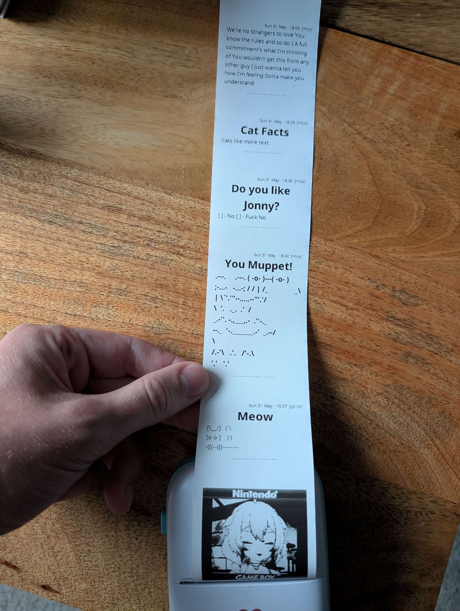

<div align="center">

# 🐱🖨️ catprint

**Print to a cheap BLE thermal printer from Claude, your phone, or any HTTP client.**

[](https://go.dev) [](https://modernc.org/sqlite) [](https://modelcontextprotocol.io)



https://github.com/user-attachments/assets/a7dfae13-e2a4-426c-92ed-633e1b8a1746

</div>

---

## What it does

Turns a [PD01 58mm BLE thermal printer](https://www.amazon.co.uk/dp/B0CWGYQX41) (a.k.a cat printer) into a cute portable fax machine or simple way to print things from your phone.

Integrates with AI via MCP server, tell Claude "print my shopping list" and paper comes out. Share text from any Android app via an installable PWA. POST markdown or images via the web interface. Catprint validates it against the printer's real constraints, renders it to a 1-bit bitmap, and streams it over Bluetooth.

> **Hardware:** built for the [PD01 58mm BLE thermal printer](https://www.amazon.co.uk/dp/B0CWGYQX41) (~£10).

- 🖨️ **PD01 BLE driver** — connect-on-demand, keepalive to defeat idle sleep
- 📝 **Markdown renderer** — goldmark → 384px 1-bit bitmap, embedded Noto fonts + emoji
- 🖼️ **Image printing** — any PNG/JPEG/GIF/BMP, resized + Floyd–Steinberg dithered
- ✅ **Pre-render validator** — catches over-long lines / unsupported syntax before paper is wasted, with line-specific feedback the LLM can self-correct
- 🤖 **MCP server** — four tools over streamable HTTP; print straight from Claude
- 📱 **Web UI + Android PWA** — share-sheet target, job history, reprint
- 💾 **SQLite job queue** — persist, retry, expire, reprint
- 🪶 **One static binary** — pure Go, no CGO, Linux + Windows

## Quick start

```bash
go build ./...                 # build server + scripts
go run ./scripts/scan          # find your printer's BLE MAC
./bin/catprint -addr AA:BB:CC:DD:EE:FF
```

Open <http://localhost:38827> and print from the browser, or wire it into Claude (below).

Cross-compile for Windows (still no CGO):

```bash
GOOS=windows GOARCH=amd64 go build -o bin/catprint.exe .
```

## What you can print

Content is a small markdown subset, validated against the paper's real limits before rendering:

````markdown
# Title large bold, centred

## Section subheading

- bullet • item
- [ ] todo / - [x] done checkbox **bold** bold inline --- full-width divider plain paragraphs auto word-wrapped to paper width emoji 🎉 ☕ 🐱 crisp monochrome glyphs

```fenced block → verbatim monospace (ASCII art, code)
ascii art
```

```qr fenced block → centred QR code
https://example.com
```
````

Ready-made samples live in [`examples/`](examples/) — feed any of them to the web UI textarea or the `print_markdown` MCP tool:

| File                                  | Shows                      |
| ------------------------------------- | -------------------------- |
| [`showcase.md`](examples/showcase.md) | Every element on one sheet |
| [`recipe.md`](examples/recipe.md)     | Headings, lists, emoji     |
| [`trip.md`](examples/trip.md)         | Itinerary with emoji       |
| [`qr.md`](examples/qr.md)             | QR codes (URL + wifi)      |
| [`ascii.md`](examples/ascii.md)       | Monospace / ASCII art      |

## Configure

Flags, or the matching env var (load via `.env` — see `.env.example`):

| Flag         | Env               | Default                             |
| ------------ | ----------------- | ----------------------------------- |
| `-addr`      | `PRINTER_ADDRESS` | empty → scan/discover at runtime    |
| `-port`      | `PORT`            | `38827` (web at `/`, MCP at `/mcp`) |
| `-db`        | `DB_PATH`         | `jobs.db`                           |
| `-keepalive` | —                 | `20s` (`0` = reconnect per job)     |

## Use it from Claude (MCP)

Add to `claude_desktop_config.json` (`~/Library/Application Support/Claude/` on macOS, `%APPDATA%\Claude\` on Windows):

```json
{
	"mcpServers": {
		"catprint": {
			"type": "http",
			"url": "http://localhost:38827/mcp"
		}
	}
}
```

Restart Claude Desktop — four `catprint` tools appear:

| Tool                       | Purpose                                                         |
| -------------------------- | --------------------------------------------------------------- |
| `get_printer_capabilities` | Paper size, line limits, supported markdown subset. Call first. |
| `get_printer_status`       | Reachability, queue depth, last job state.                      |
| `print_markdown`           | Validate → render → enqueue → return `{job_id, status}`.        |
| `print_image`              | Print a base64 image — resized to 384px + dithered.             |

`print_markdown` returns `{error: "validation_failed", violations: [...]}` when content breaks a constraint, so the model can fix the offending line and retry.

<details>
<summary>Drive it with raw curl</summary>

```bash
SESSION=$(curl -s -D - -X POST -H 'Content-Type: application/json' -H 'Accept: application/json, text/event-stream' \
  -d '{"jsonrpc":"2.0","id":1,"method":"initialize","params":{"protocolVersion":"2024-11-05","capabilities":{},"clientInfo":{"name":"curl","version":"0"}}}' \
  http://localhost:38827/mcp | grep -i mcp-session-id | awk '{print $2}' | tr -d '\r')

curl -s -X POST -H 'Content-Type: application/json' -H 'Accept: application/json, text/event-stream' -H "Mcp-Session-Id: $SESSION" \
  -d '{"jsonrpc":"2.0","method":"notifications/initialized"}' http://localhost:38827/mcp

curl -s -X POST -H 'Content-Type: application/json' -H 'Accept: application/json, text/event-stream' -H "Mcp-Session-Id: $SESSION" \
  -d '{"jsonrpc":"2.0","id":2,"method":"tools/call","params":{"name":"print_markdown","arguments":{"content":"# Hi\n- [ ] one\n- [x] two"}}}' \
  http://localhost:38827/mcp
```

</details>

## Run as a service

```bash
cp .env.example .env      # set PRINTER_ADDRESS, PORT, DB_PATH
make install              # build + install systemd unit + start (needs sudo)
make logs                 # tail logs
make restart              # rebuild + restart after changes
```

To reach it remotely (and to install the PWA / use the Android share target, which need HTTPS), put any HTTPS reverse proxy or tunnel in front of the single port — Cloudflare Tunnel, Tailscale Funnel, ngrok, or Caddy all work. Web UI lands at `/`, MCP at `/mcp`, so one public hostname covers both. Point the Claude config `url` at `https://<your-host>/mcp`.

> ⚠️ The MCP endpoint has **no auth**. Add a token or access policy before exposing it publicly.

## Print from your phone

The web UI is an installable PWA and registers as an Android **share target**.

1. Open `https://<your-host>/` in Chrome on Android (HTTPS required — see above).
2. **Add to Home screen** to install it as an app.
3. From any app, hit **Share → catprint** to send text or an image straight to the printer.

Shared text is printed verbatim (line breaks preserved, word-wrapped to paper width); shared images are dithered and printed. Jobs land in the same queue and history as everything else.

## Linux / BlueZ notes

- Needs `bluez` + a running `bluetooth` service: `sudo apt-get install -y bluez && sudo systemctl enable --now bluetooth`.
- `PRINTER_ADDRESS` is effectively required — name-based discovery doesn't work on BlueZ (the printer only puts its name in active-scan responses). Get the MAC with `go run ./scripts/scan` while the printer is awake and nearby.
- BlueZ can't connect to a MAC it hasn't seen advertise since boot. The queue self-heals: on a failed connect it runs a short scan to warm the cache, then retries.

## Diagnostic scripts

Standalone tools under `scripts/` (`go build ./scripts/<name>`) — they talk to the printer directly, no server needed.

| Script        | Use                                                                  |
| ------------- | -------------------------------------------------------------------- |
| `scan`        | List BLE devices to find the printer's MAC.                          |
| `test_print`  | Print a 384×60 black rectangle (driver smoke test).                  |
| `test_render` | Render the example docs to PNG (no printer) to eyeball fonts/layout. |

## Repository layout

```
printer/    PD01 BLE driver + job queue
jobs/       SQLite job log
render/     Markdown/image → 1-bit bitmap, embedded fonts
validate/   Pre-render markdown validator
mcp/        MCP tool definitions
web/        HTTP server + PWA
scripts/    Standalone CLI tools
examples/   Sample markdown
```
